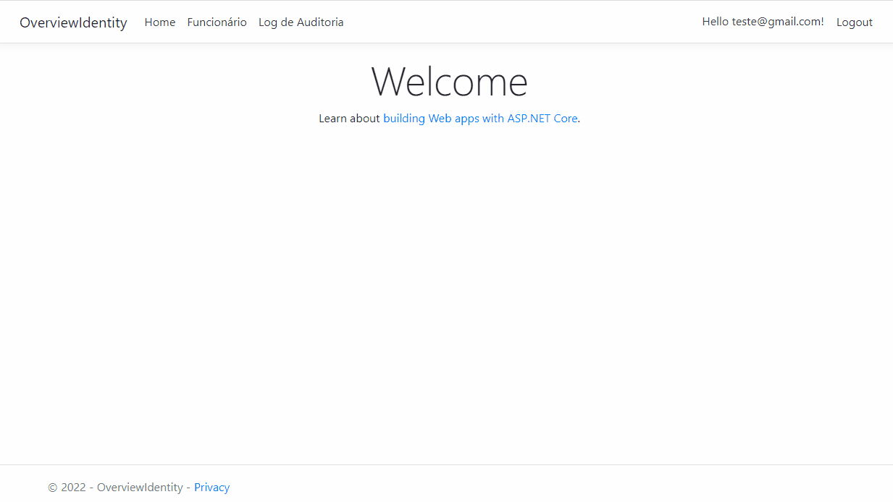

<h1 align="center">
  <span>Asp.Net Core 6 com Entity Framework e Identity</span>
</h1>

<p align="center">
  <a href="#-projeto">Projeto</a>&nbsp;&nbsp;&nbsp;|&nbsp;&nbsp;&nbsp;
  <a href="#-tecnologias">Tecnologias</a>&nbsp;&nbsp;&nbsp;|&nbsp;&nbsp;&nbsp;
  <a href="#-instalação">Instalação</a>&nbsp;&nbsp;&nbsp;|&nbsp;&nbsp;&nbsp;
  <a href="#memo-licença">Licença</a>
</p>

<br>

<p align="center">
  
</p>

<br>

## 💻 Projeto

Nesse projeto, foi desenvolvido um CRUD simples de cadastro de funcionário com ASP.NET Core MVC com Entity Framework Core. Onde são implementadas as funcionalidades de Criar, Excluir, Editar e Visualizar. A aplicação se comunica com o banco de dados SQLServer. Realiza autenticação do usuário utilizando userIdentity. Onde o usuário acessa a tela de funcionário apenas se estiver autenticado no sistema. Além disso, o sistema possui uma auditoria no qual é realizado o log de toda a adição, edição ou exclusão de um funcionário.

## 🚀 Tecnologias

Esse projeto foi desenvolvido com as seguintes tecnologias:

- HTML
- CSS
- Razor
- Entity Framework
- BootStrap
- Identity


## 📥 Instalação

Faça um clone desse repositório e acesse o diretório.

```bash

#Abra o arquivo appsettings.json e edite o campo DevConnection
$ "DevConnection": "..."

# Abra o Package Manager Console e rode o script de migração do banco
$ Add-Migration "InitialCreate"

# Atualizando o banco de dados
$ Update-Database
```

## :memo: Licença

Esse projeto está sob a licença MIT. Veja o arquivo [LICENSE](LICENSE.md) para mais detalhes.

---
**Desenvolvido por [Bruno César](https://github.com/brunocs90).**
